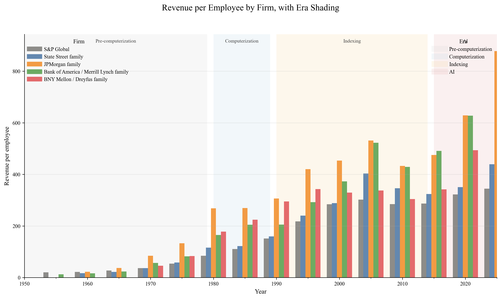
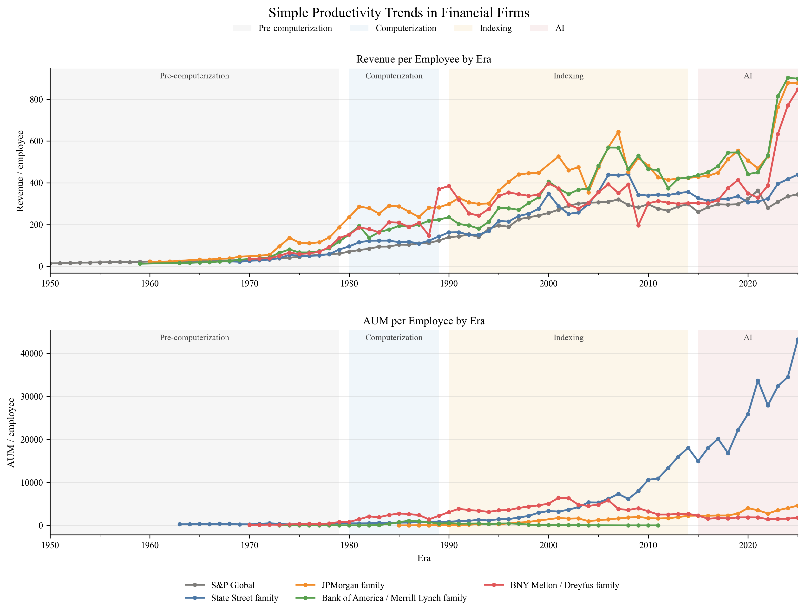
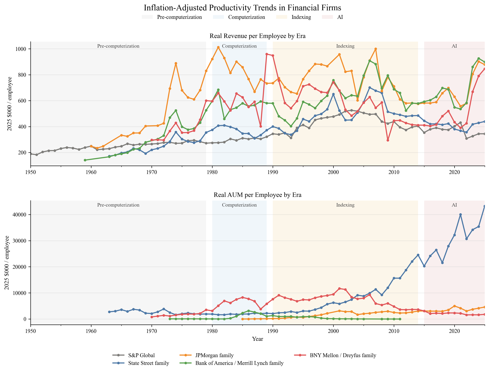
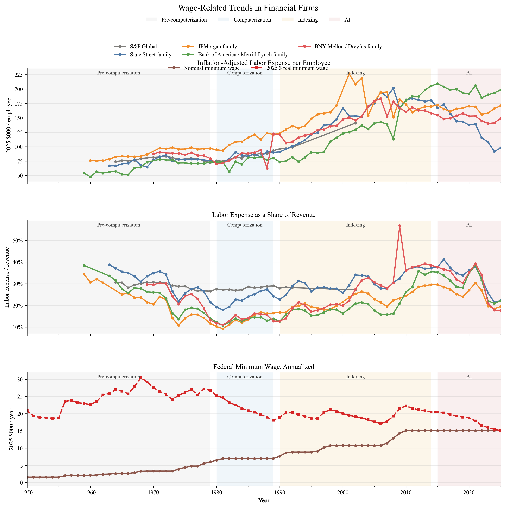

# AI Exposure and Financial Labor Reallocation: Evidence from Official SEC 10-K Filings

## Abstract

This paper studies how agentic AI may affect the financial labor market by constructing a text-based AI exposure proxy from official SEC 10-K filings. Using a small panel of five large financial firms from 2015 to 2025, the analysis measures exposure as a weighted count of direct AI terms and adjacent automation language normalized by filing length. The empirical design combines firm and year fixed effects with the resulting exposure series to examine whether within-firm changes in AI disclosure intensity are associated with changes in revenue per employee, assets under management per employee, and labor expense per employee. The baseline evidence is mixed but informative: higher AI exposure is associated with lower revenue per employee, higher AUM per employee, and no statistically clear effect on labor expense per employee. A descriptive event-study style figure also shows that the exposure series rises at different times across firms, suggesting staggered diffusion rather than a uniform sector-wide shock.

## 1 Introduction

The rapid diffusion of agentic AI has created a new question for finance: whether the technology will primarily substitute for labor, augment existing workers, or reorganize the allocation of tasks inside firms. The concern is especially relevant in financial services because the industry combines standardized reporting, large-scale data processing, client service, and judgment-intensive decision-making within the same organizational structure. As a result, even modest changes in AI capability may alter task composition before they show up as visible employment adjustments. The question is therefore not simply whether AI reduces headcount, but which margins of the firm adjust first and which outcomes move in response.

This paper develops an empirical working paper design around that question using official SEC filing data. Rather than relying on broad industry narratives or indirect surveys, the analysis extracts 10-K text from the SEC EDGAR system and builds an AI exposure proxy from the language firms use in their disclosures. The resulting series captures the intensity of direct AI terminology and nearby automation language in annual reports, normalized by filing length. This approach follows the task-based logic of Autor, the channel-based framework of Acemoglu and Restrepo, and the complementarity emphasis of Brynjolfsson and McAfee, but applies them to a finance-specific disclosure setting.

The main contribution is descriptive but economically useful. The filing-based exposure series rises over time for all five firms in the sample, yet the timing and pace differ across firms. When the exposure series is merged into a fixed-effects panel, the coefficient on AI exposure is negative and statistically significant for revenue per employee, positive and statistically significant for assets under management per employee, and small and statistically insignificant for labor expense per employee. These patterns are not sufficient for causal claims, but they are consistent with a transition in which AI changes the scale and composition of work before it translates into a clean labor-cost reduction.

## 2 Baseline Evidence from the Simple Analysis

The earlier `simple_analysis` provides the baseline descriptive motivation for the paper. That work compares firm-group productivity measures across four broad eras: pre-computerization, computerization, indexing, and AI. The regression evidence shows that both `revenue_per_employee` and `aum_per_employee` are substantially higher in later eras than in the pre-computerization benchmark, even after controlling for firm-group fixed effects. In the revenue specification, the era coefficients rise from 1.4070 in the computerization period to 2.0543 in the indexing period and 2.3688 in the AI period, while the corresponding AUM coefficients rise from 1.3638 to 2.4197 and then 3.3944. These magnitudes are not causal estimates, but they do indicate that the financial panel is moving in the same broad direction as the later SEC-based analysis.

The simple analysis also helps interpret the firm-level trend figures. The time-series plots show that revenue per employee and AUM per employee rise persistently across the sample, but the trajectories differ across firms and firm families. In particular, the visual evidence suggests that productivity growth is not uniform across the sector and that the largest firms move differently from more specialized intermediaries. This matters for the current paper because it implies that firm-specific organizational change is likely to matter as much as industry-wide technological diffusion. The chapter therefore serves as a bridge: it documents broad productivity growth first, and then motivates the move to filing-based AI exposure as a more direct measure of technology-related change.



The revenue-per-employee figure shows that productivity trends are not flat within firm groups and that the major financial intermediaries move on different trajectories. The sustained upward movement is consistent with the regression evidence that later eras are associated with substantially higher revenue intensity than the pre-computerization benchmark. At the same time, the separation between firms suggests that long-run productivity growth is not purely an industry-wide drift. That matters for the AI question because it implies that organizational adjustment and business model differences are likely to mediate any technological effect.



The era plot summarizes the broad shift in productivity across pre-computerization, computerization, indexing, and AI. The upward step pattern across eras matches the regression coefficients and makes the descriptive break visible at a glance. Because the figure aggregates the sample into broad historical periods, it is especially useful as a motivation figure rather than an identification figure. Its main role in the paper is to show that the financial panel already contains strong long-run variation before the SEC exposure proxy is introduced.



The real-era figure reinforces the same message after deflating the productivity ratios. The rise across eras remains visible in real terms, so the pattern is not an artifact of nominal growth alone. This figure is the cleanest baseline evidence that productivity levels changed materially before the SEC-based AI analysis begins. It therefore provides the strongest descriptive bridge from the historical panel to the filing-based exposure work.



The wage-trend figure adds an important labor-market dimension to the baseline chapter. The trend lines show that labor costs also evolve over time and that wage growth is not identical across firm families. This is relevant because it keeps the paper from framing AI only as an output-side story. If labor compensation rises along with productivity, then the central question becomes how much of the change is captured by output expansion, labor intensity, or internal reallocation rather than by a simple reduction in labor expense.

## 3 Literature Review

The paper sits at the intersection of task-based labor economics, the economics of automation, and the literature on digital productivity. Autor’s task framework emphasizes that technology substitutes for routine tasks while complementing abstract and interpersonal tasks, implying that technology may reshape occupations without eliminating them entirely. Acemoglu and Restrepo extend this framework by modeling automation, labor augmentation, capital augmentation, and task creation as distinct channels, which makes the distributional consequences of technological change central rather than incidental. Brynjolfsson and McAfee, by contrast, emphasize the productivity paradox and the importance of organizational complements, arguing that the gains from new technologies depend on workflow redesign, management practices, and adoption lags.

The empirical literature on AI and automation also implies that results are likely to be heterogeneous across functions and firms. In finance, some tasks are highly codifiable and therefore more exposed to automation, while other tasks depend on trust, negotiation, compliance judgment, or model oversight. The present paper is intentionally narrow in its scope: it does not attempt to measure the full labor-market impact of AI, but instead uses filings to construct a transparent proxy for firm-level exposure and examines whether that proxy aligns with changes in a small set of operating outcomes. The resulting analysis is best interpreted as an initial working paper that helps separate exposure measurement from causal identification.

## 4 Data and Method

The sample is built from official SEC 10-K filings for five large financial firms: Bank of America, BNY Mellon, JPMorgan Chase, S&P Global, and State Street. The filing corpus covers 2015 through 2025 and is fetched directly from SEC-hosted endpoints using a valid User-Agent header. The exposure measure counts direct AI language, such as “artificial intelligence,” “machine learning,” “generative AI,” and “autonomous agent,” together with adjacent automation language such as “automation,” “robotic process automation,” and “workflow automation.” Direct AI terms receive a higher weight than adjacent automation terms, and the weighted count is normalized by total filing words to form the final `ai_exposure` variable.

The panel outcomes are `revenue_per_employee`, `aum_per_employee`, and `labor_expense_per_employee`. These variables are appropriate for the present setting because they separate scale effects, business-mix effects, and labor intensity. Revenue per employee captures broad productivity in the operating sense. AUM per employee captures scale in asset management and custody-type activity. Labor expense per employee provides a direct though incomplete proxy for labor cost pressure. The baseline specification is

```text
log(1 + outcome_it) = beta * ai_exposure_it + firm FE + year FE + error_it.
```

This design estimates within-firm variation over time while absorbing common macro shocks. It is therefore a panel correlation design rather than a causal design. The main use of the model is to test whether firms with more AI disclosure intensity also exhibit systematic changes in operating outcomes.

## 5 Results

The coefficient figure summarizes the fixed-effects estimates across the three outcomes. The estimated coefficient on AI exposure is negative for revenue per employee, with a point estimate of -0.0535 and a robust standard error of 0.0117. This estimate is statistically significant and economically meaningful in the context of a small panel of large financial firms. The result suggests that, within this sample, greater AI disclosure intensity is associated with lower revenue intensity per worker. That pattern may reflect organizational restructuring, reinvestment, or a shift toward lower-revenue but more automation-intensive business lines.

The coefficient on AUM per employee is positive, with a point estimate of 0.5843 and a robust standard error of 0.1646. This estimate is also statistically significant. The sign implies that firms with greater AI exposure tend to manage more assets per employee, which is consistent with the possibility that AI supports scale, monitoring, or workflow consolidation in asset and wealth-related operations. In contrast, the coefficient on labor expense per employee is small and statistically insignificant, with an estimate of 0.0107 and a robust standard error of 0.0219. This result does not support a simple story in which AI exposure immediately compresses labor expense per worker.

The coefficient figure should therefore be read as a summary of within-firm exposure effects rather than a causal estimate. Its main value is that it separates different margins of the business: a negative revenue response, a positive AUM response, and no clear labor-cost response. In a finance setting, that combination is consistent with AI changing the organization of work, improving scale in some lines, and leaving compensation intensity largely unchanged in the short run. The figure also clarifies why a single headline measure of “productivity” would be too coarse for the sector.


The event-study style figure adds a second layer of interpretation. It aligns each firm around the first year in which exposure rises above the firm’s early baseline by a fixed margin. The resulting plot shows staggered timing rather than a uniform break: Bank of America rises earlier, S&P Global accelerates later, JPMorgan and State Street rise more gradually, and BNY Mellon crosses the threshold very late in the sample. This pattern is important because it suggests that AI exposure diffuses unevenly across firms, which is exactly the kind of variation that could support richer identification strategies in a longer panel. The event-study figure should therefore be read as descriptive diffusion evidence: it shows when the exposure proxy begins to move meaningfully, not whether the technology caused a discrete outcome jump.


Taken together, the two figures imply that AI exposure in finance should not be interpreted as a single binary adoption event. Instead, it appears as a rising disclosure and organizational intensity that may affect different margins differently. The evidence is therefore more consistent with task reallocation and business-model adjustment than with an immediate across-the-board labor displacement effect. At the same time, the small sample and concentrated coverage mean that the estimates should be treated as exploratory.

## 6 Discussion

The results point to three implications for the broader literature on agentic AI and financial labor markets. First, the relevant unit of analysis is not necessarily the occupation or the firm alone, but the task bundle and disclosure intensity through which AI enters the organization. Second, AI may first appear as a change in output composition or scale, rather than a measurable fall in labor expenses. Third, the diffusion of AI across firms appears staggered, which suggests that future work should focus on adoption timing, task-specific exposure, and heterogeneity by business line.

These findings also reveal the limitations of the current analysis. The sample includes only five firms, so the statistical evidence should not be treated as general equilibrium evidence for the financial sector. The exposure measure is based on filing language, which captures disclosure intensity as well as underlying adoption, and therefore may overstate or understate true operational use. Finally, the current fixed-effects model cannot separate causality from reverse causality or omitted organizational change. The natural next step is to combine the filing-based exposure proxy with a larger sample, a stronger event-study design, and heterogeneity by firm function or job type.

## 7 Conclusion

This paper provides an initial working paper on the labor-market implications of agentic AI in finance using official SEC filing data. The main contribution is a transparent AI exposure proxy built from 10-K text and a simple panel analysis that relates the proxy to firm-level outcomes. The empirical evidence suggests that higher AI exposure is associated with lower revenue per employee, higher AUM per employee, and no clear immediate change in labor expense per employee. The event-study style figure further suggests that exposure rises at different times across firms, supporting the view that AI diffusion in finance is staggered and organizationally mediated. While the analysis is not causal, it establishes a framework that can be extended to larger samples, more detailed task measures, and sharper identification strategies.

## 8 Notes

Figure 1 refers to the coefficient plot of firm and year fixed-effects estimates for AI exposure across outcomes. Figure 2 refers to the event-study style alignment of the exposure series around each firm’s first substantive increase in disclosure intensity. The data source for both figures is official SEC 10-K filings, merged with the finance panel used in the simple analysis.


